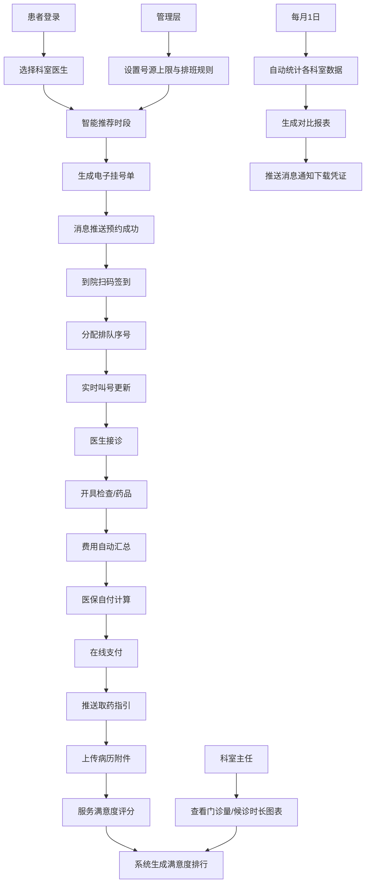

## 1. 产品概述

大型综合医院门诊挂号与就诊流程管理系统，旨在优化患者就医体验、提升医院运营效率，实现从预约挂号到就诊缴费的全流程数字化管理。

- 服务对象涵盖患者、医生、科室主任和医院管理层四类角色，覆盖预约、签到、就诊、缴费、评价等全流程
- 通过智能排班推荐、实时叫号系统、医保自动结算和数据可视化分析，构建高效、透明、便民的智慧医疗服务平台

## 2. 核心功能

### 2.1 用户角色

| 角色 | 登录方式 | 核心权限 |
|------|----------|----------|
| 患者 | 手机号/身份证登录 | 预约挂号、扫码签到、在线缴费、上传病历、服务评价 |
| 医生 | 工号登录 | 查看排班、叫号接诊、开具检查/药品处方、查看病历 |
| 科室主任 | 工号登录 | 查看科室门诊量、候诊时长统计、满意度排行、医生工作量 |
| 医院管理层 | 管理员账号 | 设置号源上限、制定排班规则、查看全院统计报表、月度对比分析 |

### 2.2 功能模块

1. **患者端主页**：预约挂号入口、我的挂号单、签到状态、缴费提醒
2. **预约挂号页**：科室选择、医生排班展示、智能时段推荐、电子挂号单生成
3. **签到叫号页**：扫码签到、排队序号分配、实时叫号进度展示
4. **就诊缴费页**：费用汇总、医保自付计算、在线支付、取药指引
5. **病历评价页**：病历附件上传、服务评分、满意度反馈
6. **医生工作台**：今日排班、待诊患者列表、叫号操作、开单（检查/药品）、病历查看
7. **科室主任仪表盘**：门诊量统计图、候诊时长分析、满意度排行榜
8. **管理层控制台**：号源配置、排班规则设置、全院收入/满意度/工作量月度报表

### 2.3 页面详情

| 页面名称 | 模块名称 | 功能描述 |
|----------|----------|----------|
| 登录选择页 | 角色选择卡片 | 四种角色入口切换，各角色独立登录表单 |
| 患者主页 | 快捷操作区 | 挂号/签到/缴费/评价入口图标，待办事项提醒卡片 |
| 患者主页 | 我的挂号单列表 | 挂号状态（待就诊/进行中/已完成）、就诊时间、科室医生 |
| 预约挂号页 | 科室医生选择 | 科室树状导航、医生卡片（职称、擅长、评分） |
| 预约挂号页 | 智能排班推荐 | 按号源余量自动排序、最优时段高亮推荐、号源实时余量显示 |
| 预约挂号页 | 挂号确认 | 就诊信息确认、电子挂号单生成（二维码+编号） |
| 签到叫号页 | 扫码签到 | 模拟扫码功能、自动分配排队序号、签到成功动画 |
| 签到叫号页 | 实时叫号大屏 | 当前叫号、等待人数、预计等待时间、滚动公告栏 |
| 就诊缴费页 | 费用明细 | 检查费/药品费分类展示、医保政策说明、自付金额计算 |
| 就诊缴费页 | 支付与取药 | 支付方式选择、支付成功凭证、取药窗口指引 |
| 病历评价页 | 病历上传 | 支持图片/PDF附件上传、病历列表管理 |
| 病历评价页 | 服务评分 | 医生态度/专业度/就诊环境分项评分、满意度提交 |
| 医生工作台 | 排班与叫号 | 今日排班时段、待诊队列、一键叫号、已叫号历史 |
| 医生工作台 | 开单处方 | 检查项目选择、药品处方开具、费用自动汇总 |
| 医生工作台 | 患者病历 | 患者历史就诊记录、已上传附件查看 |
| 科室主任仪表盘 | 数据可视化 | 门诊量趋势图（折线）、候诊时长分布（柱状）、满意度排行（条形） |
| 管理层控制台 | 号源排班配置 | 各科室号源上限表单、排班规则模板（按周/按天）、保存生效 |
| 管理层控制台 | 月度报表 | 各科室收入对比、满意度对比、医生工作量统计、报表下载按钮 |
| 消息中心 | 实时通知 | 预约成功/签到提醒/缴费通知/报表推送等消息列表、凭证下载 |

## 3. 核心流程

患者通过系统选择科室和医生，系统基于排班和号源余量智能推荐时段并生成电子挂号单；到院后扫码签到获得排队序号，叫号大屏实时更新进度；医生接诊后开具检查或药品，系统自动汇总费用；患者根据医保政策计算自付金额并完成在线支付，获取取药指引；就诊结束后患者可上传病历附件并对服务打分评价。科室主任查看本科室门诊量与候诊时长统计图及满意度排行；管理层配置号源上限与排班规则；每月1日系统自动统计全院各科室收入、满意度和医生工作量，生成对比报表并推送通知。

## 4. 用户界面设计

### 4.1 设计风格

- **主色调**：深邃医疗蓝 `#0A66C2` 作为品牌主色，传递专业、信赖感；辅助色为宁静青 `#00B4D8`，用于强调操作按钮和状态提示
- **背景色**：采用分层灰阶体系，页面背景 `#F0F4F8`（冷白灰），卡片背景纯白 `#FFFFFF`，边框分割线 `#E2E8F0`
- **强调色**：健康绿 `#10B981`（成功/可用）、警示橙 `#F59E0B`（等待/提醒）、紧急红 `#EF4444`（超号/异常）
- **按钮风格**：圆角 8px，主按钮使用实色填充+细微内阴影，悬停状态向上浮起 2px 配合柔和阴影过渡
- **字体体系**：标题使用思源宋体（Display）营造专业厚重感，正文使用思源黑体（Source Han Sans SC）确保阅读清晰度
- **字号层级**：主标题 28px / 副标题 20px / 正文 14px / 辅助文字 12px
- **布局风格**：卡片式布局配合全局 24px 网格间距，顶部导航栏固定高度 64px，左侧角色侧边栏宽度 240px
- **图标风格**：使用线性图标（stroke-width 1.5px），医疗场景图标（十字、听诊器、药瓶等）融入微渐变填充
- **数据可视化**：图表采用柔和渐变填充，柱状/折线端点带发光标记点，鼠标悬浮显示详细数据气泡

### 4.2 页面设计概览

| 页面名称 | 模块名称 | UI 元素 |
|----------|----------|---------|
| 登录选择页 | 角色卡片 | 4 张渐变背景卡片（患者蓝/医生青/主任紫/管理深蓝），悬停时卡片上浮并出现光晕，点击后展开登录表单 |
| 患者主页 | 快捷操作区 | 4 个大尺寸圆角图标按钮（挂号/签到/缴费/评价），网格 2x2 布局，点击涟漪动效 |
| 患者主页 | 挂号单列表 | 时间线式列表，左侧状态色条（蓝=待就诊/青=进行中/灰=已完成），右侧操作按钮 |
| 预约挂号页 | 科室医生选择 | 左侧科室树形导航，右侧医生卡片网格（头像、职称、评分、可预约状态徽章） |
| 预约挂号页 | 智能时段推荐 | 时间轴横向排布，时段胶囊按钮，最优时段带金色「推荐」徽章并脉冲动画，号源不足标红警示 |
| 签到叫号页 | 叫号大屏 | 大面积深色背景，当前叫号数字使用大号发光字体，等待列表滚动播放，顶部公告跑马灯 |
| 就诊缴费页 | 费用明细 | 分类折叠面板，医保报销比例可视化进度条，自付金额大号强调显示 |
| 医生工作台 | 待诊队列 | 三列布局：待叫号/就诊中/已完成，患者卡片拖拽式流转，叫号按钮脉冲呼吸灯 |
| 科室主任仪表盘 | 统计图表 | 三栏图表网格，每个图表卡片带渐变标题栏，数据标签动态浮现动画 |
| 管理层控制台 | 月度报表 | 数据对比表格，行交替底色，差异数值标红/标绿箭头指示，导出按钮悬浮固定 |
| 消息中心 | 通知列表 | 左侧消息分类标签，右侧消息卡片，未读消息带红点和蓝色左侧边框 |

### 4.3 响应式设计

- 采用桌面优先（Desktop-first）设计，主视图宽度适配 1440px 及以上
- 断点 1024px：侧边栏折叠为图标栏，图表区域自适应单列堆叠
- 断点 768px：顶部导航栏简化，卡片列表转为全宽单列，表格支持横向滚动
- 所有按钮和交互元素最小触控区域 44×44px，确保平板设备操作友好

### 4.4 动效设计

- 页面入场：卡片元素按 80ms 错位渐入（staggered fade-in-up），透明度 0→1，位移 20px→0
- 按钮交互：悬停时 translateY(-2px) + box-shadow 扩散，点击时 scale(0.97) 回弹
- 状态变更：叫号更新时数字放大 1.1 倍 + 绿色光晕闪烁，支付成功时出现圆形对勾勾选动画
- 图表加载：柱状图从底部生长，折线图从左至右描边绘制，时长 600ms，ease-out 缓动
- 消息推送：右上角消息气泡滑入，轻微抖动提示，3 秒后自动折叠
