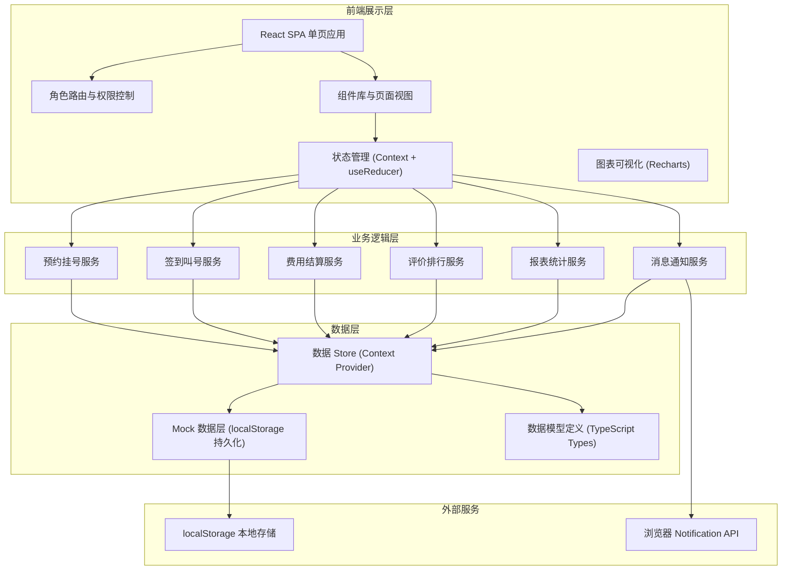
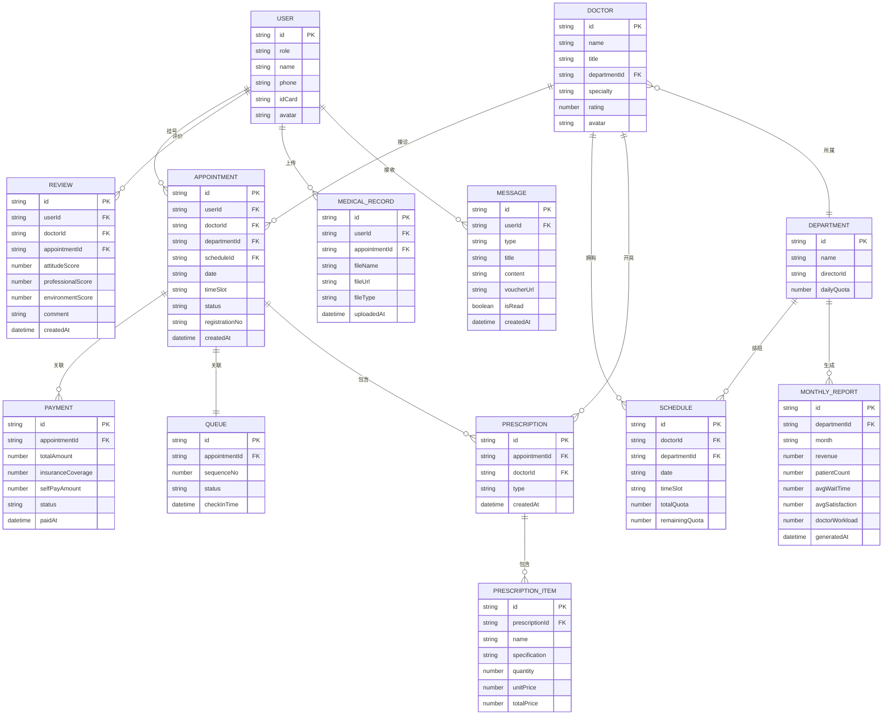

## 1. 架构设计



## 2. 技术描述

- **前端框架**：React@18 + TypeScript@5，函数式组件 + Hooks
- **构建工具**：Vite@5，HMR 热更新，开箱即用的 TS 支持
- **样式方案**：TailwindCSS@3.4 + PostCSS，配合 CSS 变量实现主题系统
- **路由管理**：React Router@6，嵌套路由 + 角色权限守卫
- **状态管理**：React Context + useReducer，分模块 Store（用户/挂号/消息/报表）
- **图表可视化**：Recharts@2，折线图/柱状图/条形图/饼图
- **图标方案**：Lucide React，线性风格图标库
- **数据持久化**：localStorage，模拟后端存储，支持刷新保留状态
- **后端**：无后端服务，全部使用 Mock 数据 + 前端模拟业务逻辑

## 3. 路由定义

| 路由路径 | 页面用途 | 访问角色 |
|----------|----------|----------|
| `/login` | 登录选择页（四种角色入口） | 公开 |
| `/patient` | 患者主页（快捷操作 + 挂号单列表） | 患者 |
| `/patient/appointment` | 预约挂号（科室/医生/时段选择） | 患者 |
| `/patient/checkin` | 扫码签到 + 叫号大屏 | 患者 |
| `/patient/payment` | 费用明细 + 在线支付 | 患者 |
| `/patient/records` | 病历上传 + 服务评价 | 患者 |
| `/doctor` | 医生工作台（排班 + 待诊队列） | 医生 |
| `/doctor/prescription` | 开单处方（检查/药品） | 医生 |
| `/doctor/records` | 患者病历查看 | 医生 |
| `/director` | 科室主任仪表盘（统计图表） | 科室主任 |
| `/admin` | 管理层控制台（号源 + 排班配置） | 管理层 |
| `/admin/reports` | 月度报表中心 | 管理层 |
| `/messages` | 消息中心（所有角色通用） | 所有登录用户 |

## 4. 数据模型

### 4.1 ER 图



### 4.2 核心数据结构（TypeScript）

```typescript
export type UserRole = 'patient' | 'doctor' | 'director' | 'admin';

export interface User {
  id: string;
  role: UserRole;
  name: string;
  phone: string;
  idCard?: string;
  avatar?: string;
  departmentId?: string;
}

export interface Department {
  id: string;
  name: string;
  directorId: string;
  dailyQuota: number;
  description: string;
}

export interface Doctor {
  id: string;
  name: string;
  title: string;
  departmentId: string;
  specialty: string;
  rating: number;
  reviewCount: number;
  avatar: string;
}

export interface Schedule {
  id: string;
  doctorId: string;
  departmentId: string;
  date: string;
  timeSlot: 'morning' | 'afternoon' | 'evening';
  startTime: string;
  endTime: string;
  totalQuota: number;
  remainingQuota: number;
}

export type AppointmentStatus = 'pending' | 'checked_in' | 'in_progress' | 'completed' | 'cancelled';

export interface Appointment {
  id: string;
  userId: string;
  doctorId: string;
  departmentId: string;
  scheduleId: string;
  date: string;
  timeSlot: string;
  status: AppointmentStatus;
  registrationNo: string;
  sequenceNo?: number;
  createdAt: string;
}

export interface Prescription {
  id: string;
  appointmentId: string;
  doctorId: string;
  type: 'examination' | 'medicine';
  items: PrescriptionItem[];
  createdAt: string;
}

export interface PrescriptionItem {
  id: string;
  name: string;
  specification?: string;
  quantity: number;
  unitPrice: number;
  totalPrice: number;
  insuranceRatio: number;
}

export interface Payment {
  id: string;
  appointmentId: string;
  items: PrescriptionItem[];
  totalAmount: number;
  insuranceCoverage: number;
  selfPayAmount: number;
  status: 'unpaid' | 'paid';
  paidAt?: string;
  pickupWindow?: string;
}

export interface Review {
  id: string;
  userId: string;
  doctorId: string;
  appointmentId: string;
  attitudeScore: number;
  professionalScore: number;
  environmentScore: number;
  comment?: string;
  createdAt: string;
}

export interface MedicalRecord {
  id: string;
  userId: string;
  appointmentId: string;
  fileName: string;
  fileType: 'image' | 'pdf';
  fileSize: number;
  uploadedAt: string;
}

export type MessageType = 'appointment' | 'checkin' | 'payment' | 'report' | 'system';

export interface Message {
  id: string;
  userId: string;
  role: UserRole;
  type: MessageType;
  title: string;
  content: string;
  voucherAvailable: boolean;
  isRead: boolean;
  createdAt: string;
}

export interface MonthlyReport {
  id: string;
  departmentId: string;
  departmentName: string;
  month: string;
  revenue: number;
  revenueGrowth: number;
  patientCount: number;
  patientGrowth: number;
  avgWaitTime: number;
  avgSatisfaction: number;
  doctorWorkload: Array<{ doctorId: string; doctorName: string; patientCount: number; avgScore: number }>;
  generatedAt: string;
}
```
